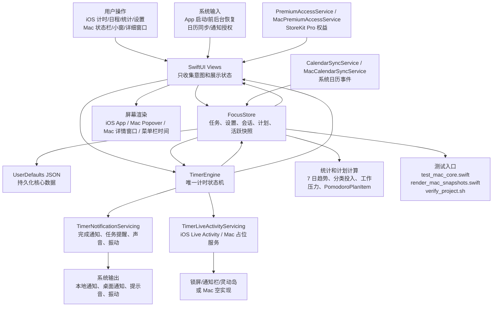
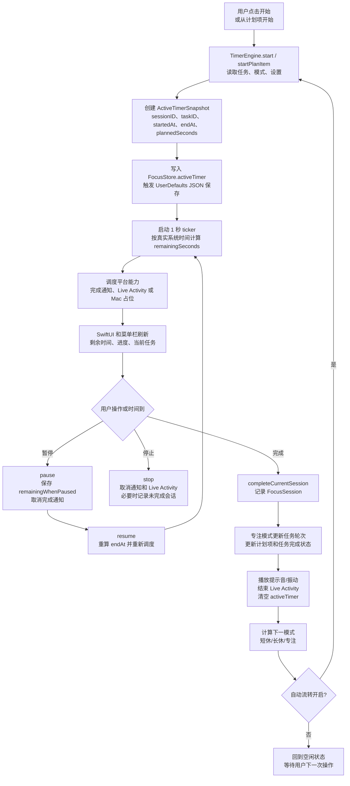
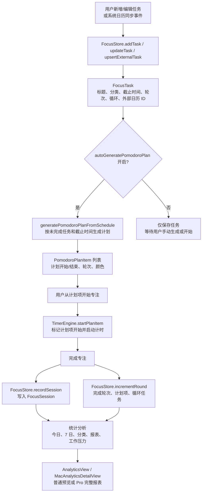
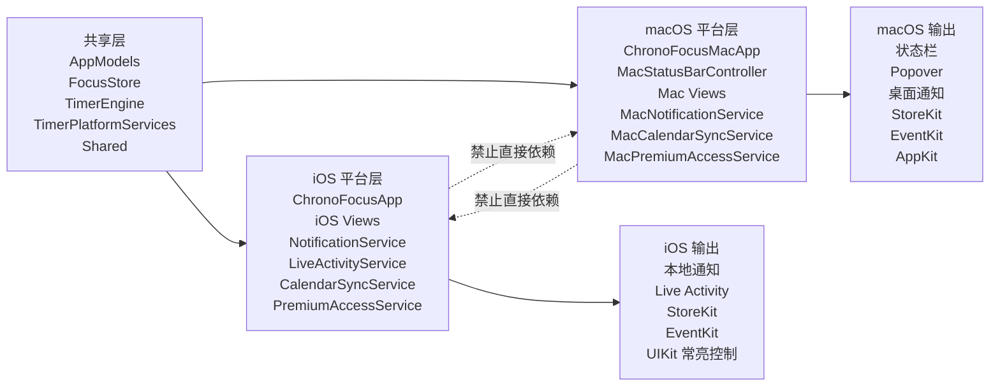
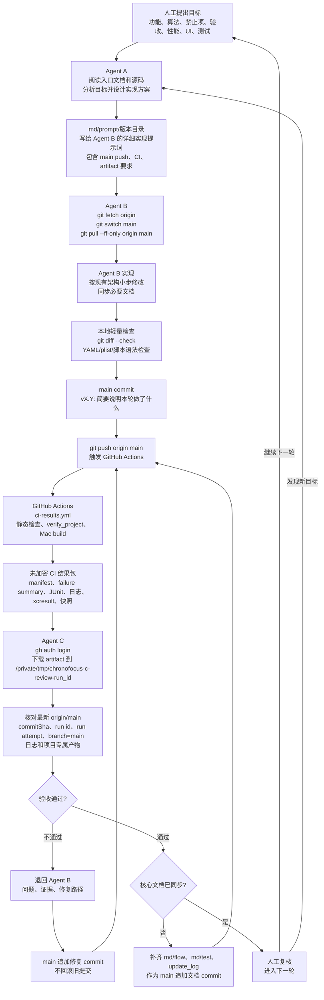

# 项目流程图

本文用 Mermaid 图展示 ChronoFocus 当前真实核心逻辑和后续 Agent 迭代流程。每张图前都有通俗读图说明，方便人工快速复核。

## 核心数据流

读图说明：这张图从“用户或系统输入”开始，看数据如何进入共享状态，再由计时引擎和平台服务输出到 UI、通知、Live Activity、持久化和测试脚本。重点看 `FocusStore` 与 `TimerEngine` 的职责边界。

## 计时执行流

读图说明：这张图描述一次番茄钟从开始到完成的执行路径。任何新增计时行为都应该落在 `TimerEngine`，不要让 View 自己维护第二套计时规则。

## 日程、计划和统计流

读图说明：这张图展示任务如何变成番茄钟计划，计时完成后又如何反向更新任务和统计。日历同步进来的事件也必须先进入 `FocusStore`，不能绕过核心数据仓库。

## 平台边界图

读图说明：这张图说明哪些代码可以共享，哪些只能在 iOS 或 macOS target 中使用。后续改平台能力时，先看这张图避免污染 target。

## Agent 迭代与云端验收流程

读图说明：这张图描述当前默认协作方式。人工提出目标后，Agent A 写提示词；Agent B 必须基于最新 `origin/main` 实现、轻量检查、提交并直推 `main`；GitHub Actions 生成未加密 CI 结果包；Agent C 下载并核对最新 run。失败时不回滚，退回 Agent B 在 `main` 追加修复 commit 后重新触发云端验证。

