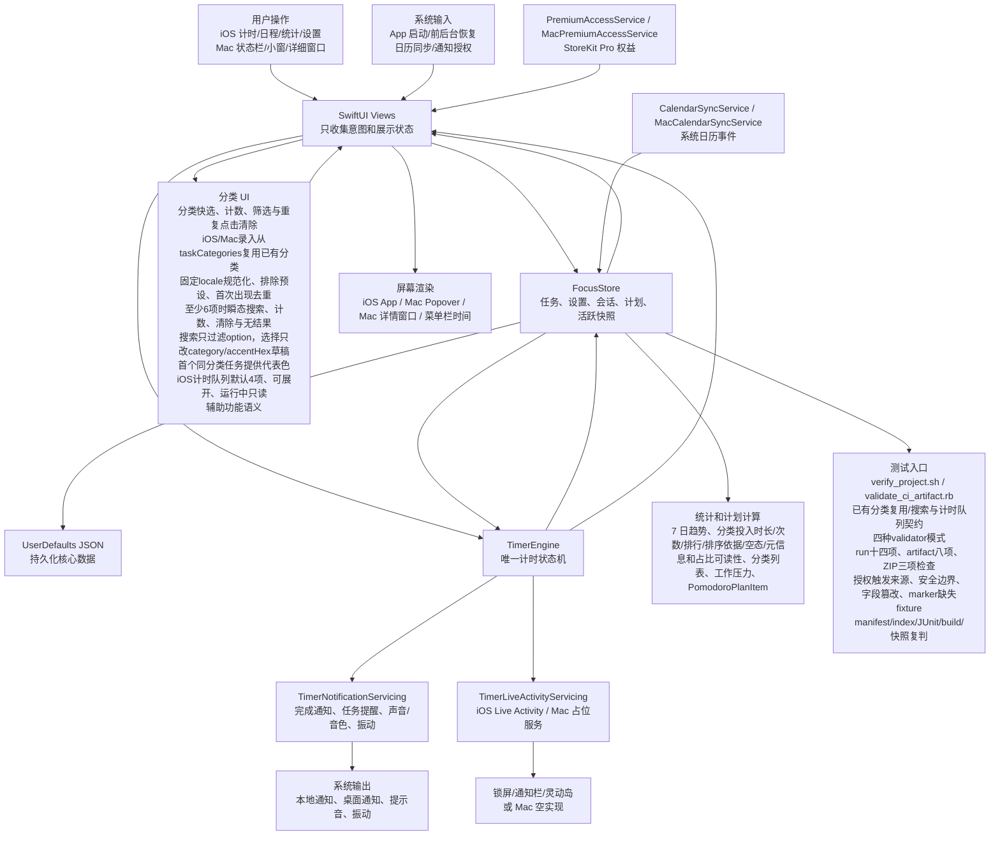
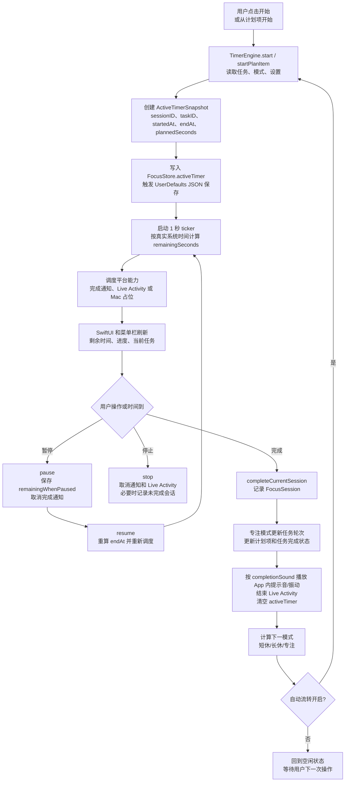
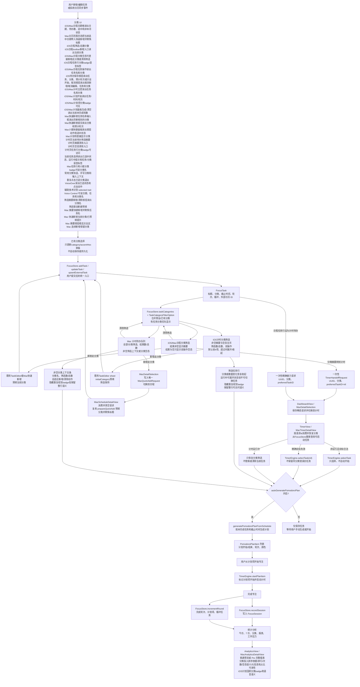
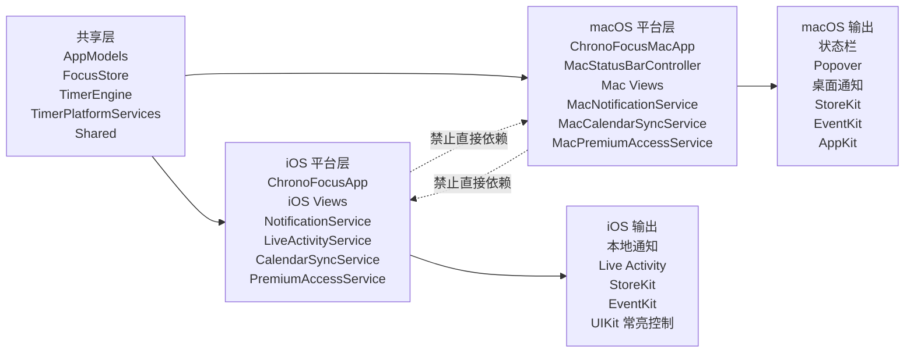
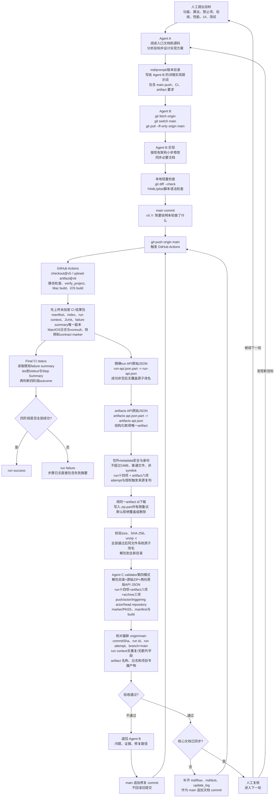
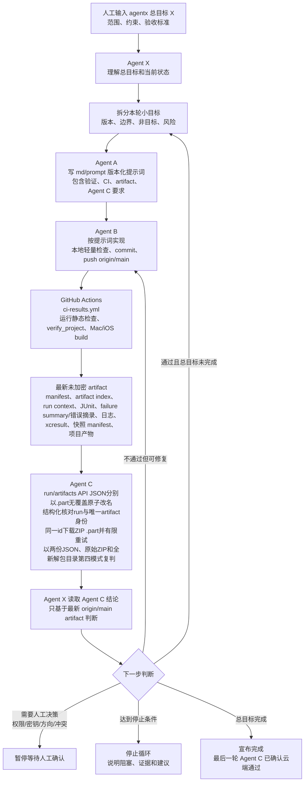

# 项目流程图

本文用 Mermaid 图展示 ChronoFocus 当前真实核心逻辑和后续 Agent 迭代流程。每张图前都有通俗读图说明，方便人工快速复核。

## 核心数据流

读图说明：这张图从“用户或系统输入”开始，看数据如何进入共享状态，再由计时引擎和平台服务输出到 UI、通知、Live Activity、持久化和测试脚本。已有分类选择和计时队列展开只属于 View 草稿/瞬态，不新增持久化或计时状态；run/artifacts 原始 API JSON 与 ZIP 由独立证据链交给 validator 复判。

```mermaid
flowchart TD
  U["用户操作<br/>iOS 计时/日程/统计/设置<br/>Mac 状态栏/小窗/详细窗口"] --> V["SwiftUI Views<br/>只收集意图和展示状态"]
  SYS["系统输入<br/>App 启动/前后台恢复<br/>日历同步/通知授权"] --> V
  V --> S["FocusStore<br/>任务、设置、会话、计划、活跃快照"]
  V --> CAT["分类 UI<br/>分类快选、计数、筛选与重复点击清除<br/>iOS/Mac录入从taskCategories复用已有分类<br/>固定locale规范化、排除预设、首次出现去重<br/>至少6项时瞬态搜索、计数、清除与无结果<br/>搜索只过滤option，选择只改category/accentHex草稿<br/>首个同分类任务提供代表色<br/>iOS计时队列默认4项、可展开、运行中只读<br/>辅助功能语义"]
  CAT --> V
  S --> P["UserDefaults JSON<br/>持久化核心数据"]
  V --> E["TimerEngine<br/>唯一计时状态机"]
  S --> E
  E --> S
  E --> N["TimerNotificationServicing<br/>完成通知、任务提醒、声音/音色、振动"]
  E --> L["TimerLiveActivityServicing<br/>iOS Live Activity / Mac 占位服务"]
  S --> C["统计和计划计算<br/>7 日趋势、分类投入时长/次数/排行/排序依据/空态/元信息和占比可读性、分类列表、工作压力、PomodoroPlanItem"]
  CAL["CalendarSyncService / MacCalendarSyncService<br/>系统日历事件"] --> S
  PRO["PremiumAccessService / MacPremiumAccessService<br/>StoreKit Pro 权益"] --> V
  S --> V
  E --> V
  V --> OUT["屏幕渲染<br/>iOS App / Mac Popover / Mac 详情窗口 / 菜单栏时间"]
  N --> OUT2["系统输出<br/>本地通知、桌面通知、提示音、振动"]
  L --> OUT3["锁屏/通知栏/灵动岛<br/>或 Mac 空实现"]
  S --> T["测试入口<br/>verify_project.sh / validate_ci_artifact.rb<br/>已有分类复用/搜索与计时队列契约<br/>四种validator模式<br/>run十四项、artifact八项、ZIP三项检查<br/>授权触发来源、安全边界、字段篡改、marker缺失fixture<br/>manifest/index/JUnit/build/快照复判"]
```

## 计时执行流

读图说明：这张图描述一次番茄钟从开始到完成的执行路径。任何新增计时行为都应该落在 `TimerEngine`，不要让 View 自己维护第二套计时规则。

```mermaid
flowchart TD
  A["用户点击开始<br/>或从计划项开始"] --> B["TimerEngine.start / startPlanItem<br/>读取任务、模式、设置"]
  B --> C["创建 ActiveTimerSnapshot<br/>sessionID、taskID、startedAt、endAt、plannedSeconds"]
  C --> D["写入 FocusStore.activeTimer<br/>触发 UserDefaults JSON 保存"]
  D --> E["启动 1 秒 ticker<br/>按真实系统时间计算 remainingSeconds"]
  E --> F["调度平台能力<br/>完成通知、Live Activity 或 Mac 占位"]
  F --> G["SwiftUI 和菜单栏刷新<br/>剩余时间、进度、当前任务"]
  G --> H{"用户操作或时间到"}
  H -->|暂停| I["pause<br/>保存 remainingWhenPaused<br/>取消完成通知"]
  I --> J["resume<br/>重算 endAt 并重新调度"]
  J --> E
  H -->|停止| K["stop<br/>取消通知和 Live Activity<br/>必要时记录未完成会话"]
  H -->|完成| L["completeCurrentSession<br/>记录 FocusSession"]
  L --> M["专注模式更新任务轮次<br/>更新计划项和任务完成状态"]
  M --> N["按 completionSound 播放 App 内提示音/振动<br/>结束 Live Activity<br/>清空 activeTimer"]
  N --> O["计算下一模式<br/>短休/长休/专注"]
  O --> P{"自动流转开启?"}
  P -->|是| B
  P -->|否| Q["回到空闲状态<br/>等待用户下一次操作"]
```

## 日程、计划和统计流

读图说明：这张图展示任务如何变成番茄钟计划，计时完成后又如何反向更新任务和统计。新增/编辑表单可从 store 的完整分类列表复用非预设分类，但选择只修改表单草稿；用户提交后才通过既有 `FocusStore` 入口持久化并刷新筛选、计划和统计。

```mermaid
flowchart TD
  A["用户新增/编辑任务<br/>或系统日历同步事件"] --> P0["分类 UI<br/>iOS/Mac日程日期格读出日期、待办数、选中和非本月状态<br/>Mac日历范围空态把当前选中日期带入快速新增并聚焦标题<br/>iOS日程筛选/总数计数<br/>iOS日程toolbar新增入口读出当前分类<br/>iOS/Mac日程分类空态可直接新增此分类或清除筛选<br/>iOS日程任务行分类badge语音标签<br/>iOS/Mac日程任务操作读出任务名和分类<br/>iOS待办保存按钮读出任务、分类、预计轮次或只设开始，取消按钮读出取消新增/取消编辑、任务和分类<br/>iOS/Mac计时主控读出任务名和分类<br/>iOS/Mac计划开始读出任务/时间/轮次<br/>iOS/Mac计划项分类badge可见<br/>iOS/Mac计划面板生成/清空读出当前未完成轮数<br/>Mac快速新增任务名称输入框读出将新增到的分类<br/>Mac快速新增提交读出分类和预计轮次<br/>Mac小窗快捷面板读出按钮动作和选中状态<br/>Mac计划项直接显示分类<br/>计时页当前待办筛选摘要<br/>计时页摘要清除入口<br/>计时页空态清除入口<br/>计时页任务行分类badge可访问<br/>当前任务选择读出已选中状态、运行中提示和任务/分类语音标签<br/>Mac任务行和小窗分类badge可说分类名<br/>常用分类快选、手写分类和输入上下文<br/>重复点击已选分类退出<br/>VoiceOver读出已选状态和点击动作<br/>辅助技术识别 selected trait<br/>Voice Control 可说日期、任务和分类名<br/>筛选摘要新增/清除按钮读出分类名<br/>筛选联动新建预填<br/>Mac 摘要快捷新增并聚焦任务名<br/>Mac 快速新增当前分类/已预填提示<br/>Mac 摘要按钮稳定点击区<br/>Mac 连续新增保留分类"]
  P0 --> DRAFT["已有分类选择<br/>只更新category/accentHex草稿<br/>不自动保存或持久化"]
  DRAFT --> B["FocusStore.addTask / updateTask / upsertExternalTask<br/>用户提交后的统一入口"]
  B --> C["FocusTask<br/>标题、分类、截止时间、轮次、循环、外部日历 ID"]
  C --> C2["FocusStore.taskCategories + TaskCategoryFilterOption<br/>合并预设/已有分类<br/>有任务分类优先显示"]
  C2 --> IS["iOS/Mac日程分类筛选<br/>结果非空显示摘要<br/>结果为空只显示双操作空态"]
  IS -->|新增此分类| SE["既有TaskEditor或Mac快速新增<br/>预填当前分类"]
  SE --> B
  IS -->|清除筛选| C2
  IS -->|分类摘要转到计时| TH["一次性 TimerHandoffRequest<br/>UUID、分类、preferredTaskID=nil"]
  C -->|日程任务行设为计时待办| TE["一次性精确接力请求<br/>UUID、分类、preferredTaskID"]
  TH --> TN["DashboardView / MacDetailSelection<br/>保存瞬态请求并切换到计时"]
  TE --> TN
  TN --> TV["TimerView / MacTimerDetailView<br/>按请求id消费并恢复分类<br/>从FocusStore重新查询可启动任务"]
  TV -->|非运行且目标合法| TS["TimerEngine.selectTask<br/>只选择，不自动开始"]
  TV -->|精确目标失效| TC["TimerEngine.selectTask(nil)<br/>不保留同分类错误旧任务"]
  TV -->|计时运行中| TB["只恢复分类筛选<br/>不替换或清除当前任务"]
  TS --> D
  TC --> D
  TB --> D
  C2 --> IT["iOS计时分类筛选<br/>非空摘要与空态互斥<br/>筛选数/总数、双操作<br/>默认前4项、超过时展开/收起"]
  IT -->|新增此分类| IE["既有TaskEditor sheet<br/>initialCategory预填<br/>筛选保持"]
  IE --> B
  IT --> IR["筛选任务行<br/>分类或数量变化恢复收起<br/>运行中可展开浏览但不可切换任务<br/>隐藏重复视觉badge<br/>保留整行可访问语义"]
  IR --> D
  C2 --> MT["Mac 计时待办队列<br/>全部/分类筛选、结果数/总数<br/>非空筛选上下文或分类空态"]
  MT --> C3["非空分类上下文条<br/>分类名、筛选数/总数<br/>自适应新增/清除动作<br/>隐藏重复视觉badge但保留整行语义"]
  MT -->|新增此分类| MS["MacDetailSelection<br/>写入唯一 MacQuickAddRequest<br/>切换到日程"]
  MT -->|清除筛选| C2
  MS --> MQ["MacScheduleDetailView<br/>消费并清空请求<br/>复用 prepareQuickAdd 预填分类并聚焦标题"]
  MQ --> B
  C3 --> D{"autoGeneratePomodoroPlan 开启?"}
  D -->|是| E["generatePomodoroPlanFromSchedule<br/>按未完成任务和截止时间生成计划"]
  D -->|否| F["仅保存任务<br/>等待用户手动生成或开始"]
  E --> G["PomodoroPlanItem 列表<br/>计划开始/结束、轮次、颜色"]
  G --> H["用户从计划项开始专注"]
  H --> I["TimerEngine.startPlanItem<br/>标记计划项开始并启动计时"]
  I --> J["完成专注"]
  J --> K["FocusStore.incrementRound<br/>完成轮次、计划项、循环任务"]
  J --> L["FocusStore.recordSession<br/>写入 FocusSession"]
  L --> M["统计分析<br/>今日、7 日、分类、报表、工作压力"]
  K --> M
  M --> N["AnalyticsView / MacAnalyticsDetailView<br/>普通预览或 Pro 完整报表<br/>分类投入排序依据/排行/次数/空态语义/元信息和占比可读性<br/>iOS计划回顾分类badge和语音语义"]
```

## 平台边界图

读图说明：这张图说明哪些代码可以共享，哪些只能在 iOS 或 macOS target 中使用。后续改平台能力时，先看这张图避免污染 target。

```mermaid
flowchart LR
  SH["共享层<br/>AppModels<br/>FocusStore<br/>TimerEngine<br/>TimerPlatformServices<br/>Shared"] --> IOS["iOS 平台层<br/>ChronoFocusApp<br/>iOS Views<br/>NotificationService<br/>LiveActivityService<br/>CalendarSyncService<br/>PremiumAccessService"]
  SH --> MAC["macOS 平台层<br/>ChronoFocusMacApp<br/>MacStatusBarController<br/>Mac Views<br/>MacNotificationService<br/>MacCalendarSyncService<br/>MacPremiumAccessService"]
  IOS --> IOUT["iOS 输出<br/>本地通知<br/>Live Activity<br/>StoreKit<br/>EventKit<br/>UIKit 常亮控制"]
  MAC --> MOUT["macOS 输出<br/>状态栏<br/>Popover<br/>桌面通知<br/>StoreKit<br/>EventKit<br/>AppKit"]
  IOS -.禁止直接依赖.-> MAC
  MAC -.禁止直接依赖.-> IOS
```

## Agent 迭代与云端验收流程

读图说明：这张图描述当前默认协作方式。Agent C 分别无覆盖保存精确 workflow run API 和 artifacts API 原始 JSON，再用 artifacts 响应中的唯一 id 约束 ZIP 下载；两份 JSON 和 ZIP 都使用 `.part` 与原子改名，最终连同全新解包目录进入 validator 第四模式。

```mermaid
flowchart TD
  H["人工提出目标<br/>功能、算法、禁止项、验收、性能、UI、测试"] --> A["Agent A<br/>阅读入口文档和源码<br/>分析目标并设计实现方案"]
  A --> P["md/prompt/版本目录<br/>写给 Agent B 的详细实现提示词<br/>包含 main push、CI、artifact 要求"]
  P --> B0["Agent B<br/>git fetch origin<br/>git switch main<br/>git pull --ff-only origin main"]
  B0 --> B1["Agent B 实现<br/>按现有架构小步修改<br/>同步必要文档"]
  B1 --> L["本地轻量检查<br/>git diff --check<br/>YAML/plist/脚本语法检查"]
  L --> G["main commit<br/>vX.Y: 简要说明本轮做了什么"]
  G --> PUSH["git push origin main<br/>触发 GitHub Actions"]
  PUSH --> CI["GitHub Actions<br/>checkout@v5 / upload-artifact@v6<br/>静态检查、verify_project、Mac build、iOS build"]
  CI --> ART["先上传未加密 CI 结果包<br/>manifest、index、run context、JUnit、failure summary唯一副本<br/>Mac/iOS日志与xcresult、快照和contract marker"]
  ART --> SUM["Final CI status<br/>读取既有failure summary<br/>tee到stdout与Step Summary<br/>再判断四阶段outcome"]
  SUM --> RESULT{"四阶段是否全部成功?"}
  RESULT -->|是| OK["run success"]
  RESULT -->|否| FAIL["run failure<br/>步骤日志直接包含失败摘要"]
  ART --> RUNAPI["精确run API原始JSON<br/>run-api.json.part -> run-api.json<br/>成功非空后无覆盖原子改名"]
  RUNAPI --> API["artifacts API原始JSON<br/>artifacts-api.json.part -> artifacts-api.json<br/>结构化取得唯一artifact"]
  API --> META["包外metadata安全与身份<br/>不超过1MiB、普通文件、非symlink<br/>run十四项 + artifact八项<br/>attempt与授权触发来源复判"]
  META --> DL["用同一artifact id下载<br/>写入.zip.part并有限重试<br/>默认拒绝覆盖或删除"]
  DL --> ZIP["校验size、SHA-256、unzip -t<br/>全部通过后同文件系统原子改名<br/>解包到全新目录"]
  ZIP --> C["Agent C validator第四模式<br/>解包目录+原始ZIP+两份原始API JSON<br/>run十四项+artifact八项+archive三项<br/>push/actor/triggering actor/head repository<br/>marker/PASS、manifest与build"]
  C --> V["核对最新 origin/main<br/>commitSha、run id、run attempt、branch=main<br/>run context无重复/无额外字段<br/>artifact 名称、日志和项目专属产物"]
  V --> PASS{"验收通过?"}
  PASS -->|不通过| BACK["退回 Agent B<br/>问题、证据、修复路径"]
  BACK --> FIX["main 追加修复 commit<br/>不回滚旧提交"]
  FIX --> PUSH
  PASS -->|通过| DOC{"核心文档已同步?"}
  DOC -->|否| D["补齐 md/flow、md/test、update_log<br/>作为 main 追加文档 commit"]
  D --> PUSH
  DOC -->|是| J["人工复核<br/>进入下一轮"]
  J -->|继续下一轮| H
  J -->|发现新目标| A
```

## Agent X 主控循环

读图说明：这张图描述人工用 `agentx:` 给出总目标后，Agent X 如何拆分轮次并调度 Agent A、Agent B、GitHub Actions 和 Agent C。Agent X 只做主控判断，不能跳过 Agent C 对最新 artifact 的验收；失败或阻塞时必须退回、暂停或停止，不能伪装成功继续下一轮。

```mermaid
flowchart TD
  H["人工输入 agentx 总目标 X<br/>范围、约束、验收标准"] --> X0["Agent X<br/>理解总目标和当前状态"]
  X0 --> X1["拆分本轮小目标<br/>版本、边界、非目标、风险"]
  X1 --> A["Agent A<br/>写 md/prompt 版本化提示词<br/>包含验证、CI、artifact、Agent C 要求"]
  A --> B["Agent B<br/>按提示词实现<br/>本地轻量检查、commit、push origin/main"]
  B --> CI["GitHub Actions<br/>ci-results.yml<br/>运行静态检查、verify_project、Mac/iOS build"]
  CI --> ART["最新未加密 artifact<br/>manifest、artifact index、run context、JUnit、failure summary/错误摘录、日志、xcresult、快照 manifest、项目产物"]
  ART --> C["Agent C<br/>run/artifacts API JSON分别以.part无覆盖原子改名<br/>结构化核对run与唯一artifact身份<br/>同一id下载ZIP .part并有限重试<br/>以两份JSON、原始ZIP和全新解包目录第四模式复判"]
  C --> X2["Agent X 读取 Agent C 结论<br/>只基于最新 origin/main artifact 判断"]
  X2 --> D{"下一步判断"}
  D -->|通过且总目标未完成| X1
  D -->|不通过但可修复| B
  D -->|需要人工决策<br/>权限/密钥/方向/冲突| P["暂停等待人工确认"]
  D -->|达到停止条件| S["停止循环<br/>说明阻塞、证据和建议"]
  D -->|总目标完成| DONE["宣布完成<br/>最后一轮 Agent C 已确认云端通过"]
```
